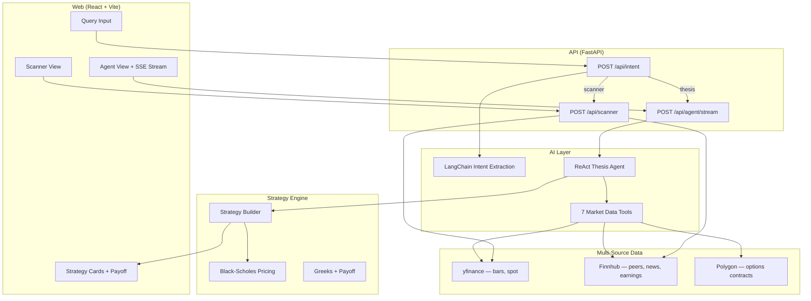

# ThetaLens

**Agentic options research platform** — describe a trade thesis in plain English and receive a researched plan with ranked option structures, payoff charts, and transparent reasoning.

ThetaLens turns queries like *"NVDA bullish rally after earnings, $1,000 risk, two weeks"* into structured research: volatility regime, earnings risk, news sentiment, expected move, and scored strategy candidates. A parallel **scanner mode** surfaces peer tickers with similar movement profiles and IV opportunity.

> **Disclaimer:** ThetaLens is for educational and research purposes only. It is not investment advice. Options trading involves substantial risk. Verify all quotes, liquidity, and execution details with your broker before trading.

**Live:** [thetalens.app](https://thetalens.app) · API health: `https://thetalens-api.onrender.com/health`

---

## Features

| Mode | Input example | Output |
|---|---|---|
| **Thesis research** | `NVDA bullish rally, 2 weeks, risk $1000` | SSE-streamed agent trace, enriched context, ranked strategies with payoff charts |
| **Scanner** | `Stocks that move like NBIS` | Peer universe ranked by IV rank, correlation, beta, and opportunity score |
| **Direct analyze** | Structured view payload | Legacy non-agent path via `POST /api/analyze` |

**What you get for each thesis run**

- Intent parsing into ticker, direction, horizon, risk budget, and mode
- ReAct agent that selects market-data tools step by step (streamed to the UI)
- Direction inference when the user leaves bias unspecified
- Deterministic strategy builder: Black–Scholes pricing, greeks, EV/POP scoring, and structure filtering
- Interactive payoff visualization and expandable strategy cards

---

## Architecture



**Pipeline:** intent extraction → agentic research (tools + reasoning) → deterministic strategy build.

See [docs/ARCHITECTURE.md](docs/ARCHITECTURE.md) for phase-by-phase detail, scoring notes, and key file map.

---

## Tech stack

| Layer | Stack |
|---|---|
| Frontend | React 19, TypeScript, Vite, Tailwind CSS 4 |
| Backend | FastAPI, Pydantic, LangChain |
| LLM | Google Gemini / Gemma (function calling); optional Ollama for local dev |
| Agent | Custom ReAct loop, 7 tools, Server-Sent Events (SSE) streaming |
| Market data | yfinance, Finnhub, Polygon.io |
| Options math | Black–Scholes, greeks aggregation, payoff simulation |
| Production | Render (API) + Vercel (web) |
| CI | GitHub Actions — secret scan, API tests, web build |

---

## Agent flow

1. **Intent extraction** — LLM parses the query into structured slots (ticker, direction, horizon, budget, mode). Regex fallback runs if the LLM is unavailable.
2. **Research agent** — ReAct loop (max 10 steps) calls tools one at a time; thinking, tool calls, and results stream over SSE:
   - `get_iv_rank` — volatility regime (sell vs buy premium context)
   - `get_upcoming_earnings` — catalyst risk inside the trade window
   - `get_historical_post_earnings_move` — post-earnings move history for magnitude calibration
   - `get_news_sentiment` — directional cross-check from headlines
   - `get_expected_move` — market-implied move over the target DTE
   - `calculate_magnitude` — thesis magnitude derived from market data
   - `assess_structure_fit` — recommended and contraindicated structures
3. **Direction inference** — when direction is missing or uncertain, the agent infers bias from sentiment, IV regime, and earnings proximity.
4. **Strategy builder** — ranks structures by score, probability of profit (POP), expected value (EV), and trade quality; streams results to the UI.

---

## Scanner mode

Query: *"Stocks that move like NBIS"*

The scanner discovers peers (Finnhub), pulls 90-day bars (yfinance), and ranks candidates by beta, correlation, 30-day realized vol, IV rank, and a composite opportunity score. Results link into the thesis flow with scanner context pre-filled.

---

## Getting started

### Prerequisites

- **Python 3.12+** (API)
- **Node.js 20+** (web)
- API keys: [Google AI Studio](https://aistudio.google.com/apikey) (required), [Polygon.io](https://polygon.io/) (required), [Finnhub](https://finnhub.io/) (recommended)

### Local development

**API** (from `api/`):

```bash
cp .env.example .env   # add GOOGLE_API_KEY, POLYGON_API_KEY; optional FINNHUB_API_KEY
python -m venv .venv && .venv/bin/pip install -r requirements.txt
.venv/bin/uvicorn app.main:app --reload
```

**Web** (from `web/`):

```bash
npm install
npm run dev
```

Open [http://localhost:5173](http://localhost:5173). Vite proxies `/api` and `/health` to port 8000 when `VITE_API_BASE` is unset.

### Environment variables

| Variable | Required | Purpose |
|---|---|---|
| `GOOGLE_API_KEY` | Yes | LLM for intent extraction and agent |
| `POLYGON_API_KEY` | Yes | Options contract reference |
| `FINNHUB_API_KEY` | No | Peers, earnings calendar, NLP sentiment (fallbacks exist) |
| `LLM_ACTIVE` | No | `gemini` (default) or `ollama` — see `api/llm.yaml` |
| `AGENT_MODEL` | No | Override default Gemma model alias |
| `APP_ENV` | No | `development` locally; `production` on Render |
| `CORS_ORIGINS` | Prod | Comma-separated frontend origin(s) |
| `VITE_API_BASE` | Prod | Public API URL for Vercel builds |

Full secret-handling guidance: [SECURITY.md](SECURITY.md).

---

## Deployment

Production runs as two services:

| Service | Platform | Root directory |
|---|---|---|
| FastAPI backend | [Render](https://render.com) | `api/` |
| React frontend | [Vercel](https://vercel.com) | `web/` |

**Checklist**

1. Deploy `api/` on Render using [`render.yaml`](render.yaml) (Blueprint) or a manual web service.
2. Deploy `web/` on Vercel with **Root Directory** = `web`.
3. Set `VITE_API_BASE` on Vercel → `https://thetalens-api.onrender.com`.
4. Set secrets on Render per [SECURITY.md](SECURITY.md) (`GOOGLE_API_KEY`, `POLYGON_API_KEY`, `CORS_ORIGINS`, etc.).

Deploy the API with [`render.yaml`](render.yaml); set `VITE_API_BASE` on Vercel to your Render URL. See [SECURITY.md](SECURITY.md) for secrets.

---

## Tests and evaluation

**Unit tests** (43 tests — intent parsing, scanner math, agent direction inference, strategy builder ranking):

```bash
cd api
.venv/bin/pytest tests/ -v
```

**Intent eval** — held-out prompt accuracy on 20 examples: [docs/EVAL.md](docs/EVAL.md).

```bash
cd api && .venv/bin/python scripts/eval_intent.py
```

CI runs secret scanning (Gitleaks), API tests, and a production web build on every push and pull request (see [`.github/workflows/ci.yml`](.github/workflows/ci.yml)).

---

## API reference

| Endpoint | Description |
|---|---|
| `POST /api/intent` | Structured intent extraction (thesis / scanner mode) |
| `POST /api/agent/stream` | SSE-streamed ReAct agent + strategy build |
| `POST /api/agent/run` | Non-streaming agent (JSON) |
| `POST /api/scanner` | Similar-stock scanner with IV rank and opportunity score |
| `POST /api/analyze` | Direct analyze path (legacy) |
| `POST /api/chat` | Chat completion endpoint |
| `GET /api/runtime` | Runtime / LLM config (admin key in production) |
| `GET /health` | Health check |

OpenAPI docs are available at `/docs` in non-production environments.

---

## Data sources

| Data | Primary | Fallback |
|---|---|---|
| Daily bars, spot price | yfinance | Polygon |
| Company peers | Finnhub | Polygon |
| News sentiment, earnings | Finnhub | Polygon news heuristic |
| Options contract reference | Polygon | — |
| Option pricing (strategy build) | Black–Scholes (RV-calibrated) | — |

---

## Project structure

```
thetalens/
├── api/
│   ├── app/
│   │   ├── agents/          # ReAct thesis agent
│   │   ├── chains/          # LangChain intent extraction
│   │   ├── tools/           # Agent tools + multi-source providers
│   │   ├── services/        # Strategy builder, scanner, market data
│   │   └── api/routes/      # FastAPI endpoints
│   ├── tests/               # pytest suite
│   └── scripts/eval_intent.py
├── web/
│   └── src/                 # React UI (phase-based state machine)
├── docs/
│   ├── ARCHITECTURE.md
│   └── EVAL.md
├── render.yaml              # Render Blueprint
└── .github/workflows/ci.yml
```

---

## License

MIT — see [LICENSE](LICENSE). Educational and portfolio use. Not financial advice.
