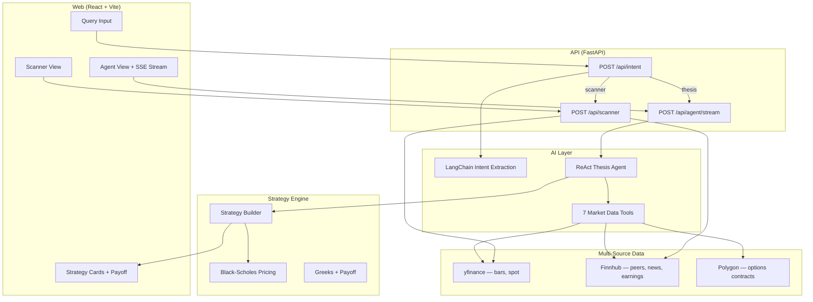

# ThetaLens

Agentic options research platform — natural-language thesis in, ranked strategies out.

Turn a plain-English view ("NVDA rally after earnings, $1000 risk") into a researched trade plan: IV regime, earnings risk, sentiment, expected move, and ranked option structures with payoff charts.

> **Disclaimer:** ThetaLens is for educational and research purposes only. It is not investment advice. Options trading involves substantial risk. Verify all quotes and liquidity with your broker before trading.

## Demo

Record a short screen capture of the agent flow and add it here:

`docs/demo.gif` *(optional — add after recording)*

Example prompts to demo:

- `NVDA bullish rally, 2 weeks, risk $1000`
- `What's the best options play on AAPL right now?`
- `Stocks that move like NBIS`

## Architecture



See [docs/ARCHITECTURE.md](docs/ARCHITECTURE.md) for a detailed breakdown.

## Tech stack

| Layer | Stack |
|---|---|
| Frontend | React 18, TypeScript, Vite |
| Backend | FastAPI, Pydantic, LangChain |
| LLM | Google Gemini / Gemma (function calling) |
| Agent | Custom ReAct loop with 7 tools, SSE streaming |
| Market data | yfinance, Finnhub, Polygon.io |
| Options math | Black-Scholes, greeks aggregation, payoff simulation |

## Agent flow

1. **Intent extraction** — LLM parses query into structured slots (ticker, direction, horizon, budget, mode).
2. **Research agent** — ReAct loop calls tools one at a time:
   - `get_iv_rank` → vol regime
   - `get_upcoming_earnings` → catalyst risk
   - `get_news_sentiment` → directional cross-check
   - `get_expected_move` → market-implied move
   - `calculate_magnitude` → thesis magnitude
   - `assess_structure_fit` → recommended / avoid structures
3. **Direction inference** — if user didn't specify direction, agent infers from sentiment, IV, and earnings.
4. **Strategy builder** — ranks structures by score, POP, EV, and trade quality; streams results to UI.

## Scanner mode

Query: *"Stocks that move like NBIS"*

Returns peers ranked by opportunity score (IV rank, correlation, beta, earnings proximity). Each card links to the strategy builder with scanner context pre-filled.

## Run locally

```bash
# API (from api/)
cp .env.example .env   # add POLYGON_API_KEY, GOOGLE_API_KEY, optional FINNHUB_API_KEY
python -m venv .venv && .venv/bin/pip install -r requirements.txt
.venv/bin/uvicorn app.main:app --reload

# Web (from web/)
npm install
npm run dev
```

Open http://localhost:5173 — Vite proxies `/api` to port 8000.

## Tests

```bash
cd api
.venv/bin/pytest tests/ -v
```

42 unit tests covering intent parsing, scanner math, agent direction inference, and strategy builder ranking.

## Eval

Intent extraction accuracy on 20 held-out prompts: see [docs/EVAL.md](docs/EVAL.md).

Re-run eval:

```bash
cd api && .venv/bin/python scripts/eval_intent.py
```

## API

| Endpoint | Description |
|---|---|
| `POST /api/intent` | Structured intent extraction (thesis / scanner mode) |
| `POST /api/agent/stream` | SSE-streamed ReAct agent + strategy build |
| `POST /api/agent/run` | Non-streaming agent (JSON) |
| `POST /api/scanner` | Similar-stock scanner with IV rank and opportunity score |
| `POST /api/analyze` | Direct analyze path (legacy) |
| `GET /health` | Health check |

## Data sources

| Data | Primary | Fallback |
|---|---|---|
| Daily bars, spot price | yfinance | Polygon |
| Company peers | Finnhub | Polygon |
| News sentiment, earnings | Finnhub | Polygon news heuristic |
| Options contract reference | Polygon | — |
| Option pricing (strategy build) | Black-Scholes (RV-calibrated) | — |

## Project structure

```
thetalens/
├── api/
│   ├── app/
│   │   ├── agents/          # ReAct thesis agent
│   │   ├── chains/          # LangChain intent extraction
│   │   ├── tools/           # Agent tools + multi-source providers
│   │   ├── services/        # Strategy builder, scanner, market data
│   │   └── api/routes/      # FastAPI endpoints
│   ├── tests/               # pytest suite
│   └── scripts/eval_intent.py
├── web/
│   └── src/                 # React UI
└── docs/
    ├── ARCHITECTURE.md
    └── EVAL.md
```

## License

MIT — see [LICENSE](LICENSE). Educational / portfolio use. Not financial advice.
